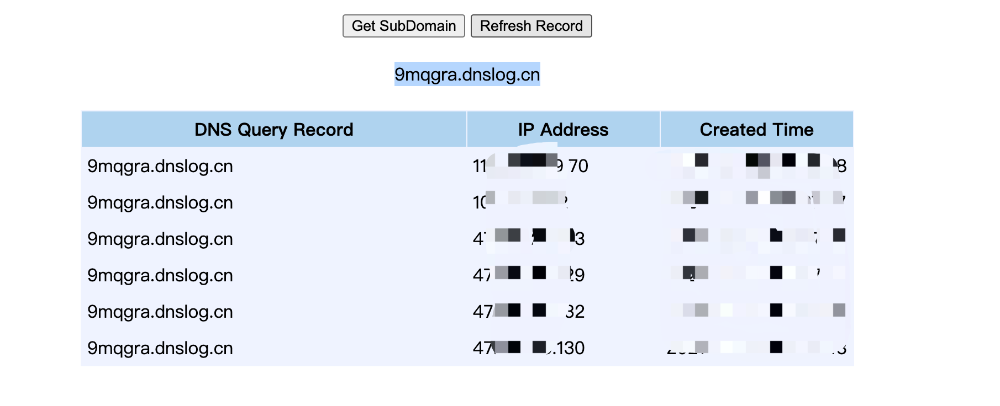

在获取到阿里云 ak-sk 后可直接批量管理并执行命令
pip install aliyun-python-sdk-core
pip install aliyun-python-sdk-ecs

使用：

在第 18、64行 AcsClient('ak', 'sk', '%s' % region)

分别填入 ak，sk 的值如 AcsClient('aaaaaak', 'sssssssk', '%s' % region)即可

会自动去阿里云全地区寻找所属云机器

python3 aliyun-ask.py -h

--info info 

输出阿里云 ak-sk 所有云机器的数量和详情

--commond “xxx”

批量执行命令如：“xxx”可直接输入命令

